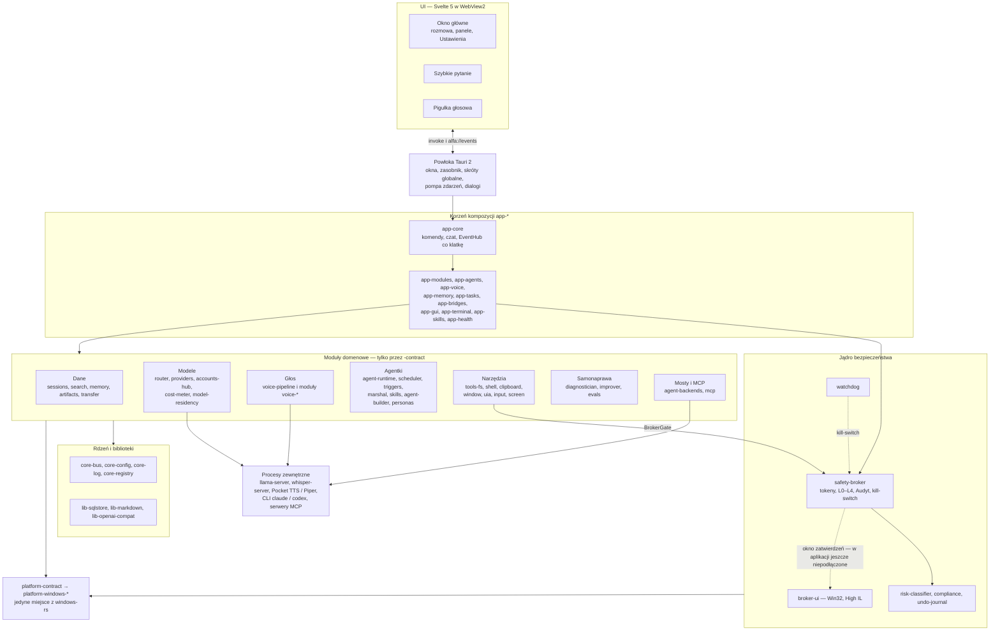
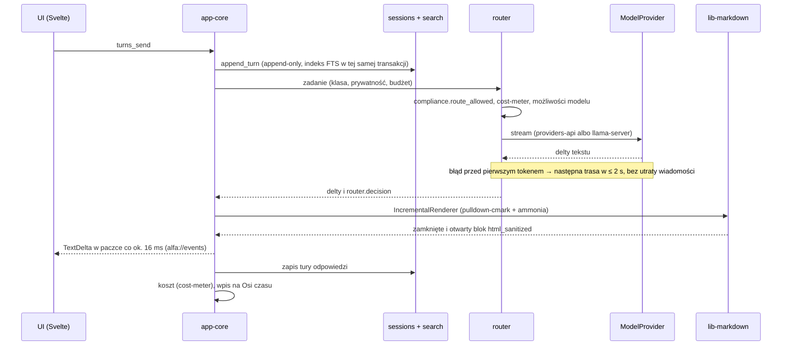
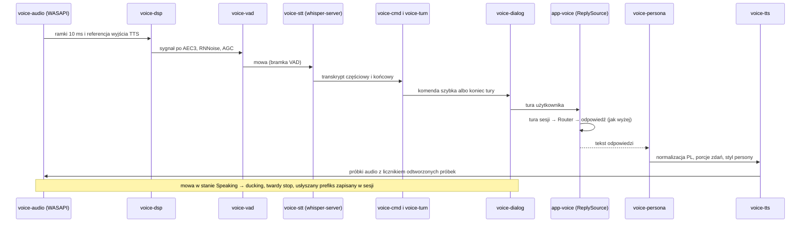
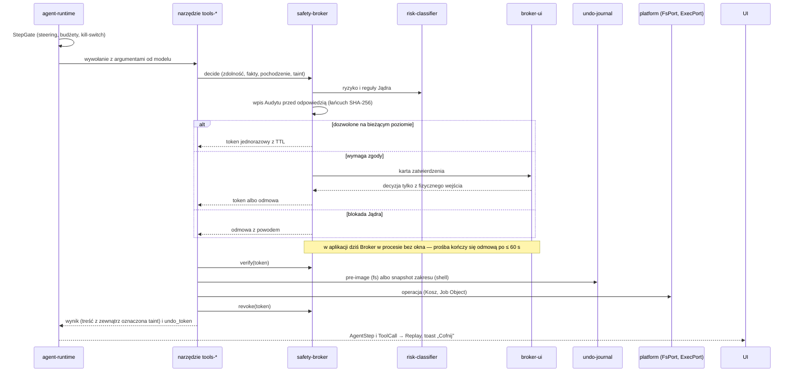

# Alfa — architektura

> Dokument pochodny od `docs/PLAN.md` (§3, §5.1, §8, §13). Plan jest źródłem prawdy; ten dokument go nie zmienia, tylko rozwija. Wartości oznaczone „do ustalenia w F0" nie są rozstrzygnięte w planie.

## 1. Zasady, które kształtują architekturę

| # | Zasada (plan §2) | Skutek architektoniczny |
|---|---|---|
| 1 | Lekkość | moduł nieużywany nie kosztuje RAM/CPU: ładowanie na żądanie, zwalnianie po bezczynności |
| 2 | Mikrojądro | jądro to kilka MB bez logiki domenowej; wszystko inne to moduł z manifestem |
| 3 | Zbudowane dla AI | małe moduły mieszczące się w oknie kontekstu, jeden kontrakt na moduł, `-fake` do testów bez sprzętu |
| 4 | Wszystko jest zdarzeniem | magistrala + append-only dziennik: logi, postępy, cofanie, replay, samodoskonalenie |
| 5 | Przerywalność wszędzie | anulowanie w kontraktach (`stream`, `cancel`), kill-switch poza UI |
| 6 | Najmniejsze uprawnienia | tokeny zdolności, potomek ≤ rodzic, reguły tylko zawężają |
| 7 | Jądro bezpieczeństwa poza zasięgiem agentów | Broker jako osobny proces na osobnym koncie |
| 9 | Fallback na każdej ścieżce | Router, łańcuchy silników głosu, CPU jako zapas GPU |

## 2. Schemat

```
┌────────────────── UI (Tauri 2 · WebView2 · Svelte 5) ──────────────────┐
│ Powierzchnia │ Panele chowane: Sesje·Agentki·Oś czasu·Pliki·Pamięć·Ekran·Głos │ Ustawienia│
└───────────────▲────────────────────────────────────────────────────────┘
                │ typowane komendy + strumień zdarzeń (minimalne capabilities per okno)
┌───────────────┴────────────── JĄDRO „Alfa Core" (Rust, ≈ kilka MB) ────────────────┐
│ Magistrala zdarzeń · Rejestr modułów · Konfiguracja · Klient Brokera · Log-writer   │
│ (bez logiki domenowej; wszystko poniżej to moduły z manifestem)                     │
└──▲────────────────────────▲────────────────────────▲──────────────────────▲───────┘
   │ in-proc (feature flag) │ osobny proces (stdio/pipe)│ Wasm (wasmtime+WIT)   │
┌──┴───────────┐ ┌──────────┴────────┐ ┌────────────────┴───┐ ┌───────────────┴────┐
│ Krytyczne:   │ │ Ciężkie/awaryjne: │ │ Wtyczki AI,        │ │ Zewnętrzne:        │
│ voice-audio, │ │ STT/TTS/LLM local,│ │ umiejętności       │ │ serwery MCP, CLI   │
│ scheduler,   │ │ przeglądarka,     │ │ (sandbox, limity)  │ │ (mosty, „opaque    │
│ memory, router│ │ UIA-helper        │ │                    │ │ worker")           │
└──────────────┘ └───────────────────┘ └────────────────────┘ └────────────────────┘
        ┌──────────────────────────────────────────────────────────────┐
        │ BROKER (usługa w tle, osobne konto): tokeny zdolności,       │  + BROKER-UI (okno
        │ writer audytu, kill-switch, polityki Jądra, operacje z UAC   │  zatwierdzeń w Twojej
        └──────────────────────────────────────────────────────────────┘  sesji, wyższy poziom
        + WATCHDOG (osobny proces: restart, safe-mode, rollback, Job Objects)  integralności)
```

### 2.1 Jądro „Alfa Core"

| Składnik | Crate | Odpowiedzialność |
|---|---|---|
| Magistrala zdarzeń | `core-bus` | publikacja/subskrypcja typowanych zdarzeń, grupowanie zdarzeń do UI (batch co klatkę) |
| Rejestr modułów | `core-registry` | wczytywanie manifestów, rozwiązywanie kontraktów, cykl życia (`lazy`/`on-demand`/`always`), health-check, budżety |
| Konfiguracja | `core-config` | pliki TOML z JSON Schema, przeładowanie na żywo, warstwa wspólna + nakładka per maszyna |
| Log-writer | `core-log` | zapis strumieni innych niż Audyt (§7 tego dokumentu) |
| Klient Brokera | część `core-*` | kanał do usługi Brokera: żądanie tokenów, przekazanie próśb o zatwierdzenie, odbiór kill-switcha |
| Aktualizator | `updater` | launcher, wersje side-by-side, rollback (ADR 7) |

Jądro nie zawiera logiki domenowej (rozmowa, głos, narzędzia). Nie zawiera też polityk bezpieczeństwa — te trzyma Broker.

## 3. Moduł = jednostka wszystkiego

### 3.1 Trójka crate'ów

| Crate | Zawartość | Kto od niego zależy |
|---|---|---|
| `<m>-contract` | trait(y), typy, zdarzenia, JSON Schema zdarzeń | wszyscy inni (jedyna dozwolona zależność między modułami) |
| `<m>-impl` | implementacja | tylko rejestr modułów / kompozycja builda |
| `<m>-fake` | atrapa deterministyczna do testów bez sprzętu i bez sieci | testy innych modułów, symulatory (§4.5 planu) |

Test kontraktowy uruchamia ten sam zestaw przypadków przeciwko `-impl` i `-fake`; rozjazd zachowań jest błędem.

### 3.2 Manifest `module.toml`

Pola wymagane przez plan (§3.2): `id`, `version`, `kind`, kontrakty dostarczane/wymagane, żądane zdolności, budżet zasobów, cykl życia, izolacja, schemat konfiguracji, wkład do UI, health-check. Przykład (nazwy pól są propozycją; schemat manifestu powstaje w F0, pkt 2 §4.5a):

```toml
id = "voice-stt"
version = "0.1.0"
kind = "voice-engine"          # service | tool | provider | voice-engine | agent-pack | ui-panel

[contracts]
provides = ["voice-stt-contract@1"]
requires = ["core-bus-contract@1", "voice-audio-contract@1", "device-profile-contract@1"]

[capabilities]
requested = ["fs.read(%LOCALAPPDATA%/Alfa/models/**)", "gpu.compute"]

[budget]
ram_mb = 1536                  # z modelem large-v3-turbo Q5_0
cpu_pct_idle = 0
vram_mb = 2560

[lifecycle]
mode = "on-demand"             # lazy | on-demand | always
unload_after_idle_s = 300

[isolation]
mode = "process"               # inproc | process | wasm
transport = "stdio-jsonrpc"

[config]
schema = "schemas/voice-stt.config.schema.json"

[ui]
settings_page = "ui/settings/voice-stt"
panel = ""

[health]
check = "ping"
interval_s = 15
```

Budżet z manifestu jest monitorowany w runtime; przekroczenie → ostrzeżenie lub zwolnienie modułu (§3.4 planu).

### 3.3 Izolacja wg potrzeby

| Tryb | Kiedy | Mechanizm | Przykłady |
|---|---|---|---|
| `inproc` | ścieżki RT i krytyczne dla opóźnień | natywny crate za feature flagą; wątek RT; **bez Wasm/IPC w callbacku audio** | `voice-audio`, `voice-dsp`, `voice-vad`, `voice-turn`, `voice-dialog`, `scheduler`, `memory`, `router` |
| `process` | ciężkie lub awaryjne | osobny proces, JSON-RPC po stdio lub named pipe; AppContainer + Job Object dla niezaufanych | `voice-stt`, `voice-tts`, `providers-local` (llama.cpp), `tools-browser`, helper UIA |
| `wasm` | kod generowany przez AI | wasmtime + własny WIT, cel `wasip2`, bez importów WASI, limity epoch/fuel/pamięci | wtyczki, umiejętności (ADR 12) |
| zewnętrzne | procesy spoza Alfy | serwery MCP, oficjalne CLI jako „opaque worker" (§8.5 planu) | Claude Code, Codex |

Odrzucone: DLL przez `abi_stable` (ADR 2). Włączanie/wyłączanie w runtime: hot dla `process`/`wasm`, aktywacja flagą dla `inproc`. Feature flags wybierają skład builda; build minimalny = sam czat.

Wątki: UIA na dedykowanym wątku MTA; windows-rs/COM zamknięte w jednym crate `platform-windows` za traitem `SystemPort` (jedna wersja windows-rs w całym workspace).

## 4. Katalog modułów (§3.3 planu)

| Grupa | Moduł | Rola (jedno zdanie) |
|---|---|---|
| Jądro | `core-bus` | Magistrala typowanych zdarzeń, jedyny kanał między modułami i do UI. |
| Jądro | `core-registry` | Rejestr manifestów, cykl życia i health-check modułów. |
| Jądro | `core-config` | Konfiguracja TOML z JSON Schema, warstwowa (wspólna + per maszyna), przeładowanie na żywo. |
| Jądro | `core-log` | Writer strumieni logów innych niż Audyt (NDJSON + indeks SQLite). |
| Jądro | `updater` | Launcher, wersje side-by-side, aktualizacje podpisane minisign, rollback. |
| Bezpieczeństwo | `safety-broker` | Usługa na osobnym koncie: tokeny zdolności, zatwierdzenia, writer Audytu, polityki Jądra, kill-switch. |
| Bezpieczeństwo | `broker-ui` | Małe natywne okno zatwierdzeń w sesji użytkownika, na wyższym poziomie integralności. |
| Bezpieczeństwo | `watchdog` | Heartbeat, restart modułów, safe-mode po N awariach, rollback, Job Objects. |
| Bezpieczeństwo | `risk-classifier` | Ocena akcji: odwracalność, zakres, wpływ zewnętrzny, destrukcyjność, pewność STT. |
| Bezpieczeństwo | `undo-journal` | Dziennik cofania dla `fs.*`, snapshoty zakresu dla shella. |
| Bezpieczeństwo | `compliance` | Rejestr tras abonamentowych ze statusem, datą weryfikacji i wyłącznikiem. |
| Modele | `accounts-hub` | Konta i klucze (Credential Manager), katalog dostawców, kreator dodawania bez restartu. |
| Modele | `providers-local` | Wbudowany llama.cpp (Vulkan/CUDA/CPU) i adapter do zewnętrznych endpointów lokalnych. |
| Modele | `providers-api` | Adaptery API: Anthropic, OpenAI, adapter generyczny „endpoint zgodny z OpenAI/Anthropic". |
| Modele | `agent-backends` | Mosty CLI (Claude Code, Codex, później Grok Build, Kimi Code, `agy`) jako `AgentBackend`. |
| Modele | `router` | Kierowanie zadań według klasy, tagów prywatności/jurysdykcji, budżetu i opóźnienia; fallback, circuit breaker. |
| Modele | `cost-meter` | Koszty, limity (PLN, kurs NBP), wskaźniki zużycia okien planów. |
| Modele | `model-residency` | Zarządca RAM/VRAM: które modele są rezydentne, wymiana, wykrywanie pełnego ekranu. |
| Agentki | `agent-runtime` | Pętla plan → działanie → obserwacja → weryfikacja, checkpointy, budżety, steering. |
| Agentki | `personas` | Persony Alfa/Beta/Gama/Delta (imię, głos, charakter) i obsada ról. |
| Agentki | `scheduler` | Deterministyczny szeregowacz z Lock Managerem zasobów wyłącznych (`scheduler-lite` w F2). |
| Agentki | `marshal` | Marszałek: tłumaczy polecenia naturalne na deklaratywne reguły, które tylko zawężają. |
| Agentki | `agent-builder` | Kreator agentek: opis → manifest → test w piaskownicy → biblioteka. |
| Agentki | `triggers` | Harmonogram i wyzwalacze (plik, czas, skrót, fokus okna, schowek, e-mail). |
| Głos | `voice-*` | Voice Suite (~16 modułów, §6.2 planu): audio, dsp, vad, turn, stt, speaker, wake, dialog, tts, persona, cmd, dictation, readaloud, lab, s2s, transcribe. |
| System | `platform-windows` | Jedyny crate z windows-rs/COM, za traitem `SystemPort`. |
| System | `tools-fs` | Pliki i foldery z dziennikiem cofania (usuwanie domyślnie do Kosza). |
| System | `tools-shell` | PowerShell/cmd/ConPTY/WSL2/SSH ze snapshotem zakresu. |
| System | `tools-clipboard` | Schowek z historią i deny-listą. |
| System | `tools-window` | Okna, pulpity wirtualne, fokus. |
| System | `tools-uia` | UI Automation: drzewo, wzorce, ocena jakości drzewa. |
| System | `tools-vision` | Zrzuty per monitor (DPI), OCR. |
| System | `tools-input` | SendInput (mysz, klawiatura, dotyk, pióro) z weryfikacją po akcji. |
| System | `tools-browser` | Przeglądarka przez CDP/Playwright z własnym profilem i deny-listą. |
| System | `tools-office` | Office COM (Word/Excel w P1). |
| System | `tools-system` | Procesy, usługi, rejestr, ustawienia, zasilanie, sieć. |
| System | `tools-net` | HTTP/WebSocket, pobieranie z wznawianiem, egress-allowlista. |
| System | `tools-media` | Kamera, mikrofon, odtwarzanie, ffmpeg. |
| System | `mcp` | Klient MCP i serwer MCP Alfy (stdio-proxy / named pipe z ACL). |
| System | `shell-integration` | Zasobnik, toasty, handler protokołu, „Wyślij do", pasek zadań. |
| System | `notify` | Powiadomienia natywne i w aplikacji, tryb „nie przeszkadzać". |
| Dane | `memory` | Cztery warstwy pamięci z zakresami (sesja/projekt/globalna/agentka) i proweniencją. |
| Dane | `sessions` | Sesje: polityka modeli, agentki, zakres pamięci, katalog roboczy, tag prywatności. |
| Dane | `search` | FTS5 + wektory (sqlite-vec) w szyfrowanej bazie per sesja. |
| Dane | `artifacts` | Pliki oddawane przez agentki: karty, wersje, podgląd. |
| Dane | `transfer` | Import/eksport paczek `.alfa`, kopie zapasowe jako zaplanowany eksport. |
| Sprzęt | `device-profile` | Autodetekcja sprzętu, profil potoku A–D per maszyna, tryb baterii. |
| Samo-ulepszanie | `diagnostician` | Klasteryzacja błędów → hipoteza → odtworzenie → Propozycja zmiany. |
| Samo-ulepszanie | `improver` | Ulepszacz (idle/noc, modele lokalne) z bramką ewaluacyjną w Jądrze. |
| Samo-ulepszanie | `evals` | Zadania wzorcowe, zamrożone zestawy akceptacyjne, ukryty holdout. |
| Samo-ulepszanie | `plugin-runtime` | Uruchamianie wtyczek Wasm (wasmtime + WIT) z limitami. |
| UI | `ui-shell` | Okno główne, panele, tryb skupienia, wiele okien na wspólnym środowisku WebView2. |
| UI | `ui-kit` | Tokeny designu, komponenty, Storybook (jedno źródło prawdy §14.3). |
| UI | `ui-quick` | Szybkie pytanie, pigułka głosowa, menu zasobnika. |
| UI | `ui-terminal` | Wbudowany terminal ConPTY do logowania w CLI (użytkownik loguje się sam). |

## 5. Budżety lekkości (§3.4 planu; wstępne, ostateczne po pomiarze w F0)

| Wskaźnik | Cel wstępny |
|---|---|
| Instalacja bazowa (jądro + UI, bez modeli) | ≤ 40 MB; modele/moduły pobierane na żądanie |
| Zimny start do zasobnika / do okna | ≤ 1 s / ≤ 1,5 s |
| Otwarcie okna z zasobnika | ciepłe ≤ 150 ms, zimne ≤ 1 s |
| Idle bez głosu: jądro | ≤ 40 MB Private Working Set, CPU ≈ 0 |
| Idle z oknem | suma drzewa procesów (WebView2 dominuje) — cel wyznaczony w F0 (spike f) |
| Moduły głosowe | ładowane przy pierwszym użyciu, zwalniane po bezczynności |
| RAM z załadowanym głosem | ~2,5–4 GB łącznie, zapas ≥ 7 GB z 16 GB — do zmierzenia w F0 |
| VRAM (8 GB baseline) | pulpit 0,5–1 GB + STT 1–2,5 GB; LLM 3–4B Q4 obok STT; 8B tylko przy STT na CPU |
| Budżet per moduł | deklarowany w manifeście, monitorowany; przekroczenie → ostrzeżenie/zwolnienie |
| Binaria | LTO, strip; opt-level pod RT tylko tam, gdzie trzeba |

Wszystkie budżety i kryteria DoD mierzy się na **baseline** (emulowanym); mocniejsze maszyny mogą je tylko poprawiać.

## 6. Klasy sprzętu (§3.5 planu)

| Klasa | Sprzęt | Ścieżka GPU | Co daje |
|---|---|---|---|
| Baseline (minimum) | Ryzen 5 5600 · RX 7600 8 GB (RDNA3) · 16 GB · Win11 | Vulkan, bez CUDA | profile głosu A/B/C, lokalny LLM 3–4B; wszystkie DoD i budżety; brak fizycznie → emulacja limitów (6 rdzeni, 16 GB, VRAM 8 GB, korekta GPU ×2,2) |
| Desktop (Standard-AMD) | Ryzen 7 5700X3D · RX 9070 XT 16 GB (RDNA4) · 32 GB | Vulkan | whisper large-v3 pełny, LLM 8–14B Q4; główna maszyna dev i runner AMD; ROCm do sprawdzenia w F0 |
| Laptop (Laptop-CUDA) | i7-13700H · RTX 4050 6 GB · 16 GB | CUDA | whisper CUDA turbo Q5, LLM 3–4B; ciasny VRAM → rezydencja na przemian; tryb baterii, termika |
| Przyszły „Mocny" | NVIDIA ≥ 12–16 GB | CUDA | pełny lokalny stos (profil D) |

Mechanizmy: `device-profile` (autodetekcja, profil per maszyna, Kreator sprzętu), konfiguracja warstwowa z nakładką `config/machine/<id>.toml`, `model-residency` (limity VRAM/RAM, wymiana modeli, wykrywanie pełnego ekranu). Luka: RDNA3 nie jest pokryty fizycznie — fallback CPU i przypięte sterowniki.

## 7. Układ repo (§3.6 planu)

```
apps/desktop/         Tauri 2 shell + ui/ (Svelte 5)
crates/<moduł>-contract|-impl|-fake   (wg katalogu §4)
crates/core-*         jądro
sidecars/             ciężkie moduły jako osobne procesy (whisper.cpp, TTS…)
plugins/              źródła wtyczek Wasm + WIT
packages/ui-kit/      tokeny designu, komponenty, Storybook
packages/schemas/     JSON Schema zdarzeń i konfiguracji
providers-catalog/    deklaratywny katalog dostawców (§5.6 planu)
evals/                zadania wzorcowe, zamrożone zestawy akceptacyjne (hash), korpus własny (poza gitem), holdout
docs/                 PLAN.md, ARCHITECTURE.md, AI_WORKFLOW.md, ACCEPTANCE.md, VOICE.md, PERSONAS.md, UI.md,
                      THREAT_MODEL.md, ADR/, modules/<m>/SPEC.md, formats/, vendor/, compliance/
AGENTS.md  CLAUDE.md  README.md
```

## 8. Kontrakty modeli i backendów (§5.1 planu)

| Kontrakt | Jednostka | Metody | Kto implementuje |
|---|---|---|---|
| `ModelProvider` | tokeny | `capabilities()`, `stream(req)` z anulowaniem, `health()`, `cost()` | klasa A (lokalne: llama.cpp, Ollama/LM Studio przez adapter), klasa B (API: Anthropic, OpenAI, adapter generyczny), klasa D (własne) |
| `AgentBackend` | zadania | `submit_task`, `events`, `approve`, `steer`, `cancel`, `resume` | klasa C (mosty CLI jako „opaque worker"), klasa D (własne) |

Rodzaje `ModelProvider`: chat, STT, TTS, embeddings, wizja/OCR, S2S. Router kieruje **zadania** (nie żądania tokenowe) według klasy zadania × ograniczeń (tag prywatności i jurysdykcji, budżet, opóźnienie, możliwości), z fallbackiem i circuit breakerem. Mosty mają zimny start rzędu sekund → nigdy na ścieżce głosu. Mosty nie widzą tokenów CLI (deny-lista ścieżek poświadczeń, ETW w testach F4). Szczegóły: ADR 5, ADR 14, ADR 15.

## 9. Broker, Broker-UI, Watchdog (§8 planu)

| Proces | Gdzie działa | Rola | Czego nie robi |
|---|---|---|---|
| `safety-broker` (usługa) | tło, osobne konto Windows, sesja 0 | wydaje tokeny zdolności (`fs.read/write(zakres)`, `shell.exec`, `gui.control(app)`, `net.egress(host)`, `secrets.read`, `system.admin`; TTL; potomek ≤ rodzic), prowadzi zatwierdzenia, jedyny writer Audytu, trzyma polityki Jądra, obsługuje kill-switch, uruchamia operacje elewowane przez UAC | nie ma UI (sesja 0 nie pokazuje okien); nie jest wąskim gardłem logów |
| `broker-ui` | sesja użytkownika, wyższy poziom integralności niż agentki | okno zatwierdzeń: kliknięcie/klawisz z wejścia niewstrzykniętego (UIPI odrzuca SendInput z procesów agentek); opcjonalnie Windows Hello | nie renderuje treści LLM w WebView |
| `watchdog` | osobny proces | heartbeat, restart modułów, safe-mode po N awariach, rollback, zabijanie drzew przez Job Objects, obsługa kill-switcha < 200 ms | nie zależy od UI |

Jądro bezpieczeństwa (agent nie zmienia): silnik uprawnień, audyt, watchdog, aktualizator, kill-switch, tagi prywatności, budżety, egress-allowlista, klasyfikator ryzyka, polityka taint, bramka ewaluacyjna, deny-listy z §1.3 planu. Zakaz `gui.control` wobec procesów Alfy, Brokera i helpera `uiAccess`. Narzędzia wykonujące dla ≤ L3: restricted token / low-integrity / AppContainer. Szczegóły: ADR 3, ADR 15.

Kolejność w czasie: w F1 Audyt tymczasowo pisze `core-log` z oznaczeniem `pre-broker`; w F3 Broker przejmuje strumień z nowym łańcuchem hashy.

## 10. Przepływ zdarzeń i logów (§13 planu)

Zdarzenie: `{id, ts, sesja, agentka, przebieg, span, rodzaj, poziom, payload_ref, koszt, hash_prev}`. Zapis: append-only NDJSON + indeks SQLite; payloady szyfrowane kluczem per sesja (crypto-shredding — usunięcie klucza sesji kasuje treść bez łamania łańcucha). Schematy wersjonowane w `packages/schemas/` z upcasterami i testami migracji.

```
moduł ──publish──▶ core-bus ──┬──▶ subskrybenci (router, scheduler, agent-runtime, UI przez batch co klatkę)
                              ├──▶ core-log ──▶ strumienie: Wywołania modeli · Narzędzia i GUI · Głos · Diagnostyka
                              └──▶ klient Brokera ──▶ safety-broker ──▶ strumień Audyt (łańcuch hashy po digestach,
                                                                          pliki append-only przez ACL, kotwica głowy poza zasięgiem agentów)
```

| Strumień | Writer | Zawartość | Retencja |
|---|---|---|---|
| Audyt | Broker | akcje wrażliwe, decyzje uprawnień, zmiany konfiguracji i samo-zmiany; zdarzenia mostów „niezależnie niezweryfikowane" | limity dysku (do ustalenia w F0) |
| Wywołania modeli | `core-log` | dostawca, model, tokeny, koszt, opóźnienie, prompt/odpowiedź (redakcja przełączalna) | limity dysku |
| Narzędzia i GUI | `core-log` | krok + zrzut + migawka UIA, deny-lista | domyślnie 7 dni, szyfrowane |
| Głos | `core-log` | opóźnienia etapów p50/p95, fałszywe przerwania, dokładność prefiksu, echo, WER | limity dysku |
| Diagnostyka | `core-log` | błędy, moduły, watchdog | limity dysku |

Z tych samych zdarzeń powstają: drzewo postępów (Plan → kroki → status), kapsuła aktywności, Oś czasu/Replay, narracja Mówczyni (generowana ze zdarzeń, nie z pamięci modelu), sygnały dla Ulepszacza, paczka diagnostyczna. Poziomy: TRACE … AUDIT.

## 11. Zasady zależności

| Reguła | Egzekucja |
|---|---|
| Moduł zależy od innego modułu **tylko przez `<m>-contract`**; nigdy od `-impl` | sprawdzanie grafu zależności w CI (`cargo-deny` + własny skrypt), `dependency-cruiser` dla TS |
| Jądro (`core-*`) nie zależy od żadnego modułu domenowego | graf zależności w CI |
| windows-rs/COM tylko w `platform-windows`; inne moduły przez `SystemPort` | `cargo-deny` (ban crate poza allowlistą) |
| Kontrakty Rust → typy TS generowane (`tauri-specta`/`ts-rs`), JSON Schema dla zdarzeń, WIT dla Wasm | `git diff --exit-code` na plikach generowanych (ADR 13) |
| Plik ≤ ~300–400 linii, crate ≤ ~5–8 tys. linii | clippy `too_many_lines`, skrypt CI (heurystyka) |
| Zero `TODO/FIXME/unimplemented!/unwrap()` w ścieżkach produkcyjnych | lint |
| Kolejność pracy nad modułem | SPEC → kontrakt → fake → testy → implementacja → przegląd drugiego modelu → CI → merge |

## 12. Otwarte punkty (do ustalenia w F0)

| Punkt | Spike / miejsce |
|---|---|
| Dokładny schemat manifestu `module.toml` i nazwy pól | F0 pkt 2 (§4.5a planu) |
| Wartości ostateczne budżetów §5 i sumy RAM drzewa WebView2 (1 i 3 okna) | spike (f) |
| Zgodność SQLCipher + sqlite-vec + FTS5 w jednej bazie | spike (i), ADR 8 |
| Uruchomienie Broker-UI na wyższym poziomie integralności z usługi + test odrzucenia SendInput | spike (k), ADR 3 |
| Historia append-only vs bloki myślenia Anthropic | spike (g) odroczony do klucza Anthropic, ADR 6 (Tymczasowy) |
| Progi pokrycia testami (wstępnie ≥ 85% linii, ≥ 70% gałęzi) | F0 |
| Snap Layouts, Mica, pisownia PL w WebView2, toasty z AUMID przez launcher | spike (j) |
| Limity dysku strumieni logów | F0 |

## 13. Stan implementacji (październik 2026)

Stan na HEAD `51cbe91` (2026-10-02). Sekcje 1–12 opisują plan i zostają bez zmian; tu jest to, co faktycznie
zbudowano, i gdzie implementacja odeszła od planu. Macierz kryteriów akceptacji: `docs/STATUS.md`. Tabela crate'ów:
`crates/README.md`. Indeks SPEC-ów: `docs/modules/README.md`.

### 13.1 Skala

| Co                                                              | Liczba                                                                              |
| --------------------------------------------------------------- | ----------------------------------------------------------------------------------- |
| Crate'y w workspace                                             | 206: 62 `-contract`, 65 `-impl`, 61 `-fake`, 14 `app-*`, 3 `lib-*`, `spike-data`    |
| SPEC-i modułów / manifesty `module.toml`                        | 67 / 60                                                                             |
| Kontrakt UI ↔ rdzeń (`apps/desktop/ui/src/lib/api/COMMANDS.md`) | 162 komendy, 32 typy zdarzeń (wg opisu `51cbe91`), 3 okna (`main`, `quick`, `pill`) |
| Testy (bramki lokalne `51cbe91`)                                | 1846 Rust, vitest 135, Playwright E2E 62 (z axe w obu motywach)                     |
| Graf zależności (`scripts/check-deps.sh`)                       | 1265 krawędzi, 0 naruszeń                                                           |

### 13.2 Warstwy i moduły

| Warstwa                  | Moduły                                                                                                                                                                                                                                                                                                                                                                                                                                                                                                                                 | Uwagi                                                                                                    |
| ------------------------ | -------------------------------------------------------------------------------------------------------------------------------------------------------------------------------------------------------------------------------------------------------------------------------------------------------------------------------------------------------------------------------------------------------------------------------------------------------------------------------------------------------------------------------------- | -------------------------------------------------------------------------------------------------------- |
| Rdzeń                    | `core-bus`, `core-registry`, `core-config`, `core-log`; biblioteki `lib-sqlstore`, `lib-markdown`, `lib-openai-compat`; wzorzec `example-module`                                                                                                                                                                                                                                                                                                                                                                                       | `lib-*` — wspólny kod bez logiki modułu, zależy tylko od `lib-*` i `*-contract`                          |
| Platforma                | `platform-contract`, `platform-fake`, `platform-windows-impl` (pliki, Kosz, procesy i Job Objects, schowek, okna, skróty, sprzęt), `platform-windows-kernel-impl` (potoki z DACL, tożsamość klienta, okno zatwierdzeń Win32, start z integralnością High, host usługi), `platform-windows-gui-impl` (UIA, `SendInput`, zrzuty z maskowaniem), `platform-windows-pty-impl` (ConPTY), `platform-windows-sys-impl` (bezczynność, zasilanie, tryb gry, blokada sesji, obserwacja katalogów); `device-profile`; `updater` (launcher `alfa`) | jedyne crate'y z windows-rs (jedna wersja, `deny.toml` → `wrappers`)                                     |
| Dane                     | `sessions`, `search`, `memory`, `memory-consolidation`, `artifacts`, `transfer`                                                                                                                                                                                                                                                                                                                                                                                                                                                        | SQLCipher per sesja i per zakres pamięci, FTS5 + `sqlite-vec`, crypto-shredding                          |
| Modele                   | `accounts-hub`, `providers` (`providers-contract`, `-fake`, `providers-api-impl`, `providers-local-impl`), `router`, `cost-meter`, `model-residency`, `agent-backends`, `mcp`                                                                                                                                                                                                                                                                                                                                                          | Router sam jest `ModelProvider`; mosty CLI za `AgentBackend`                                             |
| Głos                     | `voice-audio`, `voice-dsp`, `voice-vad`, `voice-stt`, `voice-tts`, `voice-turn`, `voice-cmd`, `voice-dialog`, `voice-persona`, `voice-wake`, `voice-pipeline`, `voice-speaker`, `voice-dictation`, `voice-readaloud`, `voice-s2s` (tylko kontrakt i atrapa)                                                                                                                                                                                                                                                                            | `voice-pipeline` składa potok; w aplikacji podpięte F2 (rozmowa, barge-in, PTT, pigułka)                 |
| Jądro bezpieczeństwa     | `safety-broker`, `broker-ui`, `watchdog`, `risk-classifier`, `undo-journal`, `compliance`; binaria `alfa-broker`, `alfa-broker-ui`, `alfa-watchdog` w `app-safety`                                                                                                                                                                                                                                                                                                                                                                     | zmiany tylko z przeglądem człowieka (AGENTS.md)                                                          |
| Agentki                  | `agent-runtime`, `personas`, `scheduler-lite`, `scheduler`, `triggers`, `marshal`, `agent-builder`, `skills`; narzędzia `tools-common` (sam kontrakt), `tools-fs`, `tools-shell`, `tools-clipboard`, `tools-window`, `tools-uia`, `tools-input`, `tools-screen`; `ui-terminal`                                                                                                                                                                                                                                                         | każde narzędzie przez `BrokerGate`; terminal wyłącznie z gestu użytkownika                               |
| Samonaprawa              | `diagnostician`, `improver`, `evals`                                                                                                                                                                                                                                                                                                                                                                                                                                                                                                   | holdout tylko przez bramkę Jądra                                                                         |
| Aplikacja (`app-*`)      | `app-api` (DTO, porty, zdarzenia), `app-core` (komendy, czat, `EventHub`), `app-modules` (adaptery modułów), `app-store`, `app-agents`, `app-voice`, `app-memory`, `app-tasks`, `app-bridges`, `app-gui`, `app-terminal`, `app-skills`, `app-health`, `app-safety`                                                                                                                                                                                                                                                                     | jedyne crate'y, które mogą zależeć od `*-impl`                                                           |
| UI i powłoka (TS, Tauri) | `apps/desktop/src-tauri` (okna, zasobnik, skróty globalne, pompa zdarzeń, dialogi, `ShellPort`), `apps/desktop/ui` (ui-shell; ui-quick: `quick.html`, `pill.html`), `packages/ui-kit` (tokeny, komponenty, Storybook)                                                                                                                                                                                                                                                                                                                  | `notify` i `shell-integration` żyją w `app-core` (`notify`, `protocol`) i powłoce, bez własnych crate'ów |

### 13.3 Diagram warstw



### 13.4 Przepływy

**Wiadomość tekstowa → Router → dostawca → markdown → UI.** Gdy sesja ma katalog roboczy, a adresatka rolę
Wykonawczyni lub Koderki, zamiast bezpośredniego wywołania modelu startuje przebieg `agent-runtime` (przepływ C);
strumień do UI wygląda tak samo.



**Głos → potok → dialog → TTS.** Wyłączność głośnika i mikrofonu pilnuje `scheduler-lite` (w aplikacji wspólna
tablica blokad `scheduler`), modele głosu przypina `model-residency`.



**Akcja agentki → Broker → narzędzie → dziennik cofania.**



### 13.5 Odchylenia od planu (z uzasadnieniem)

| Odchylenie                                                                                                                                         | Uzasadnienie                                                                                                        | Źródło                                                      |
| -------------------------------------------------------------------------------------------------------------------------------------------------- | ------------------------------------------------------------------------------------------------------------------- | ----------------------------------------------------------- |
| Korzeń kompozycji `app-*` (14 crate'ów) zamiast samego rejestru modułów                                                                            | komendy Tauri potrzebują jednego miejsca składającego `-impl`; reguła `check-deps`: tylko `app-*` zależą od `-impl` | `crates/README.md`, SPEC `ui-shell`                         |
| Broker w procesie (`InprocBroker`) w aplikacji; usługa `alfa-broker` + `alfa-broker-ui` + `alfa-watchdog` zbudowane, ale powłoka ich nie uruchamia | etap przejściowy; bez okna zatwierdzeń — odmowa (fail-closed)                                                       | `app-modules/src/broker.rs`, SPEC `safety-broker` (część 2) |
| `platform-windows` podzielony na 5 crate'ów `-impl`                                                                                                | limit 8000 linii na crate i oddzielenie portów Jądra                                                                | przegląd #1 (c), SPEC `platform-windows`                    |
| Crate'y `lib-*` (SQLCipher, markdown, silnik HTTP/SSE)                                                                                             | wspólny kod bez logiki modułu, używany przez wiele `-impl`                                                          | `crates/README.md`                                          |
| Nowy moduł `voice-pipeline` (spoza listy §6.2)                                                                                                     | runtime składający kontrakty `voice-*` w jeden potok i runner zestawu F2                                            | SPEC `voice-pipeline`                                       |
| `memory-consolidation` osobnym modułem; silniki `memory` i `transfer` w kontrakcie                                                                 | atrapa zachowuje się jak implementacja (różni się tylko magazynem)                                                  | SPEC `memory`, `transfer`                                   |
| `tools-screen` zamiast `tools-vision`; zrzuty BitBlt / PrintWindow zamiast Windows.Graphics.Capture                                                | zrzut synchroniczny, bez WinRT/D3D11 i żółtej ramki; OCR później                                                    | SPEC `platform-windows`, `tools-screen`                     |
| `tools-common` — sam kontrakt (manifest, `Tool`, `BrokerGate`)                                                                                     | jeden protokół zgody dla wszystkich narzędzi; atrapa `ScriptedTool`                                                 | SPEC `tools-common`                                         |
| Historia konfiguracji w `history.ndjson` zamiast repo git; `core-log` bez indeksu SQLite i szyfrowania payloadów (F0)                              | prostszy dziennik append-only; reszta odłożona                                                                      | SPEC `core-config`, `core-log`                              |
| `core-registry`: `acquire(&ContractRef)` zamiast typowanego `resolve<C>()`                                                                         | trait obiektowo bezpieczny; typowany uchwyt odłożony                                                                | SPEC `core-registry`                                        |
| Kontrakty danych synchroniczne; append-only wymuszone wyzwalaczami SQLite                                                                          | SQLite blokuje — w async przez `spawn_blocking`; UPDATE/DELETE odrzucane w bazie                                    | SPEC `sessions`, `search`                                   |
| Osadzacz leksykalny (`LexicalEmbedder`) zamiast modelu ONNX                                                                                        | wyszukiwanie hybrydowe działa bez modelu ML; embedder semantyczny czeka (F7-02)                                     | `app-modules/src/embedder.rs`, SPEC `search`, `memory`      |
| STT jako `whisper-server` (HTTP na 127.0.0.1), LLM jako `llama-server` (TCP 127.0.0.1 z losowym kluczem) zamiast JSON-RPC po potoku                | gotowe protokoły whisper.cpp i llama.cpp; ryzyko ograniczone do localhost                                           | SPEC `voice-stt`, `providers-local`                         |
| VAD, KWS i ECAPA przez `tract-onnx` zamiast ONNX Runtime                                                                                           | `ort` pobiera binaria przy budowie; `tract` to czysty Rust                                                          | SPEC `voice-vad`, `voice-wake`, `voice-speaker`             |
| Broker-UI w czystym Win32 zamiast WinUI 3                                                                                                          | brak WebView i ciężkich zależności; pełna kontrola nad wejściem (`Enter` nie zatwierdza)                            | SPEC `broker-ui`                                            |
| Akcje na artefaktach jako intencje wykonywane przez platformę                                                                                      | UI nie wykonuje akcji; intencja niesie SHA-256 wersji                                                               | SPEC `artifacts`                                            |
| Typy TS pisane ręcznie (COMMANDS.md + test round-trip DTO) zamiast generatora                                                                      | generator `tauri-specta`/`ts-rs` (ADR 0013) odłożony; nazwy pól już w `snake_case`                                  | `COMMANDS.md`                                               |
| Natywne dekoracje okna zamiast własnego paska z Mica i Snap Layouts                                                                                | czeka na spike (j)                                                                                                  | SPEC `ui-shell`, `apps/desktop/README.md`                   |

### 13.6 Czego z katalogu §4 jeszcze nie ma

`plugin-runtime` (wtyczki Wasm, ADR 0012), `tools-vision` (OCR), `tools-browser`, `tools-office`, `tools-system`,
`tools-net`, `tools-media`, `voice-lab` jako narzędzie w UI (są ewaluatory CLI: `alfa-voice-eval`, `alfa-wake-eval`,
`alfa-speaker-eval`), `voice-transcribe`, adapter chmurowy `voice-s2s`, helper `uiAccess`. W aplikacji nie są jeszcze
podpięte: okno Brokera, słowa wywoławcze, weryfikacja mówcy, dyktowanie, czytanie zaznaczenia, harmonogram kopii
zapasowych, pobieranie modeli głosu i sidecarów.

### 13.7 Otwarte punkty z §12 — stan

| Punkt                                       | Stan                                                                                                            |
| ------------------------------------------- | --------------------------------------------------------------------------------------------------------------- |
| Schemat `module.toml`                       | ustalony w `core-registry-contract`; 60 manifestów, walidowanych w testach modułów (`module_manifest_is_valid`) |
| Budżety §5 i RAM drzewa WebView2            | czeka na spike (f) — `docs/STATUS.md` F0-11                                                                     |
| SQLCipher + sqlite-vec + FTS5               | rozstrzygnięte — działa (spike i, ADR 0008)                                                                     |
| Broker-UI na High IL + odrzucenie SendInput | zaimplementowane; test sprzętowy `#[ignore]` czeka na self-hosted (F0-16)                                       |
| Append-only a bloki myślenia Anthropic      | nadal ADR 0006 „Tymczasowy” (spike g wymaga klucza)                                                             |
| Progi pokrycia testami                      | pokrycie nie jest jeszcze mierzone w CI                                                                         |
| Snap Layouts, Mica, pisownia PL, AUMID      | czeka na spike (j)                                                                                              |
| Limity dysku logów                          | `core-log`: segmenty 8 MiB, 512 MiB na strumień, retencja 7 dni dla Narzędzi/GUI                                |
